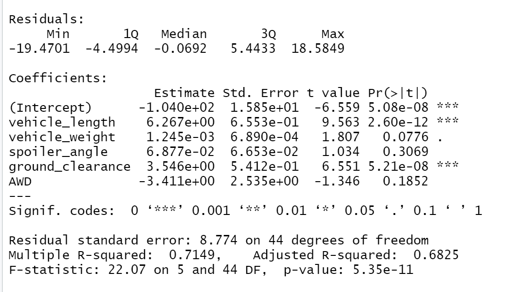

# MechaCar Analysis
2
Statistical analysis of an automobile performance using R.
3
​
4
## Overview
5
The purpose of this assignment is to perform statistical analysis on a prototype automobile's data. The insights uncovered are set to assist the manufacturing team on necessary improvements.
6

### Linear Regression to Predict MPG
7
Some main concerns we set out to answer throughout the analysis:
8
* Which variables/coefficients provided a non-random amount of variance to the mpg values in the dataset?
9
* Is the slope of the linear model considered to be zero? Why or why not?
10
* Does this linear model predict mpg of MechaCar prototypes effectively? Why or why not?
11
​
12
#### Results
13
* The most significant variables in the details that show a non-random effect on the MPG of the MechaCare are the vehicle_length and ground_clearance. The analysis provided p-values of 2.6x10^-12 and 5.21x10^-8, respectively. The intercept was also statistically significant, indicated that there are other factors not included in this analysis that have a strong impact on MPG. 
* For the linear model, the slope cannot be considered 0 as the p-value of 5.35e^-11 is less than the level of significance, assuming 95% confidence level. Therefore we can conclude there is no relationship between variables and the MPG, thus rejecting the null hypthings.
* This linear model does predict mpg of MechaCar prototypes effectively considering the coefficient of determination (r-squared) produced a value of 0.7149. This means that the linear model explains just about 71 percent of the variability, indicating our model does a good job of predicting the MPG.

14
### Summary Statistics on Suspension Coils
15
​
16
The design specifications for the MechaCar suspension coils dictate that the variance of the suspension coils must not exceed 100 pounds per square inch. The overall variance, shown above in the summary table, is under 100 PSI and meets specifications. Taking a closer look into the lot summary table, the variance for Lot 3 is well over the acceptable threshold.

17
### T-Test on Suspension Coils
Using T-tests to determine if all manufacturing lots and each individual lot are statistically different from the population mean of 1500 PSI.

Reviewing the above, it can be concluded that they are not statistically different from the population mean and the p-value is not low enough (.0603) for us to reject the null hypothesis that the true population mean is 1500
Taking a closer look into the individual lots, Lot 3 is the only lot proving to be statistically different from the others. With p-values for Lots 1 & 2 being 1 and .607 respectively, the p-value for Lot 3 being .04168 is the only value less than .05. Therefore, the only null hypothesis rejected here is that for Lot 3 and conclude the sample is significantly different from population mean.

18
### Study Design: MechaCar vs Competition
19
​As a consumer, there are many factors to take into considering when considering purchasing a new car. Something that I have considered when purchasing a new car is the trunk capacity and overall interior size. With two big dogs and children in the future, I will need a reliable car with plenty of space to hold all of my family members, including my fur-family. 
#### Metric to test
In relation to MechaCar and their competitors, I would narrow in on the volume of the interior and focus mainly on the trunk.

#### Null and Alternative Hypotheses 
h(0): The trunk capacity of MechaCars prototype is similar to competitors vehicle of same vehicle class.
h(1): The trunk capacity of MechaCars prototype is greater than the average trunk capacity of competing cars in same vehicle class. 

#### Statistical Test Used
A two-sample t-test would provide the results we are looking for.

#### Data needed
To successfully run this analysis, the average trunk size of both MechaCar and competitors would be required. 
